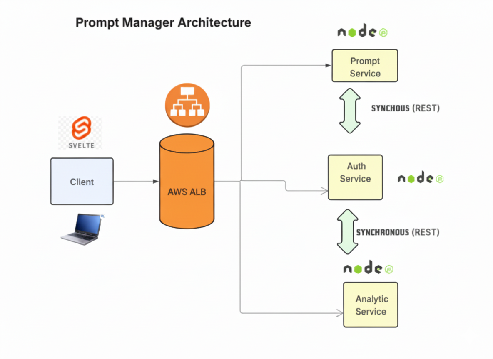

# AI Prompt Manager

## Getting Started

Run the following command at the root directory to start the application:

```bash
docker-compose up --build
```

Once the containers are up and running, access the application in your browser:

```
http://localhost:5173
```

## Architecture



## Technology Stack

- **Frontend**: Svelte
- **Backend**: Node.js
- **Database**: MongoDB

## Microservices Architecture

The application consists of three main services running in individual containers:

- **Auth Service**: Handles user authentication and authorization
- **Prompt Service**: Manages prompt CRUD operations
- **Analytics Service**: Provides analytics and reporting features

All containers are orchestrated using Docker Compose to create a unified application.
